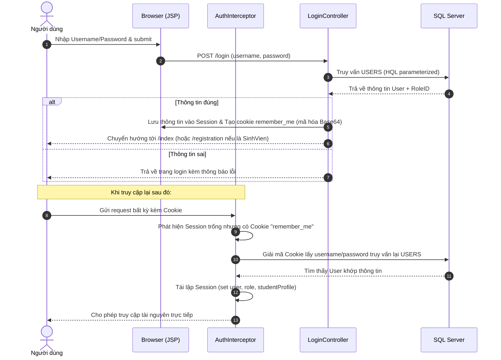
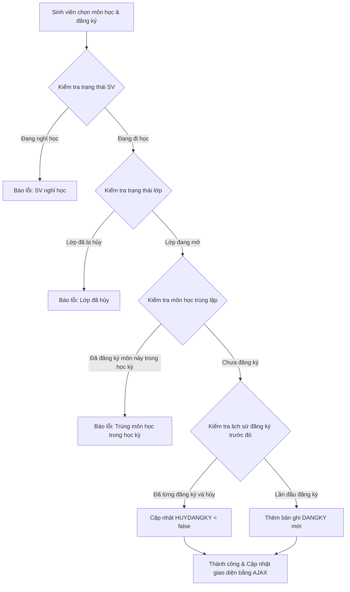

# 🏫 Dự Án Quản Lý Điểm Sinh Viên Hệ Tín Chỉ (QLDSV_HTC_WEB)

Chào mừng bạn đến với **QLDSV_HTC_WEB** - hệ thống Web quản lý điểm sinh viên học theo hệ thống tín chỉ. Dự án được phát triển theo mô hình MVC sử dụng các công nghệ Spring Framework (Spring MVC, Spring ORM), Hibernate, và SQL Server.

---

## 📘 Tài Liệu Liên Quan
> [!IMPORTANT]
> Dự án này đi kèm tài liệu tổng hợp kiến thức bài học lý thuyết & thực hành liên quan (bao gồm Spring MVC Lifecycle, Hibernate ORM, Composite Keys, Security Interceptor, API RESTful/AJAX, và Stored Procedures).
>
> 👉 **[Đọc tài liệu tổng hợp kiến thức tại đây (LESSON NOTES)](./LESSON_NOTES.md)**

---

## 📚 Phân Chia Chương Bài Học (Mục lục chi tiết)
*   **[Chương 1: Kiến Trúc Spring MVC & Luồng Xử Lý](./docs/Chuong_1_Spring_MVC.md)**
*   **[Chương 2: Quản Trị Giao Dịch & Tương Tác CSDL với Hibernate ORM](./docs/Chuong_2_Hibernate_ORM.md)**
*   **[Chương 3: Xử Lý Khóa Chính Phức Hợp (Composite Key)](./docs/Chuong_3_Composite_Keys.md)**
*   **[Chương 4: Bảo Mật & Phân Quyền Vai Trò (RBAC) với Interceptor](./docs/Chuong_4_Auth_Interceptor.md)**
*   **[Chương 5: Tích Hợp API Restful & Cơ Chế AJAX](./docs/Chuong_5_API_RESTful_AJAX.md)**
*   **[Chương 6: Tối Ưu Hóa Câu Lệnh SQL & Gọi Stored Procedure](./docs/Chuong_6_Stored_Procedures.md)**

---

## 🛠️ Công Nghệ Sử Dụng

Dự án được xây dựng dựa trên ngăn xếp công nghệ (Tech Stack) chuẩn Enterprise:
*   **Ngôn ngữ chính:** Java 17
*   **Framework cốt lõi:** Spring Framework 6.1.4 (Web MVC, Transaction, ORM)
*   **Công nghệ View:** Jakarta Servlet 6.0, JSP 3.1.1, JSTL 3.0
*   **Thư viện ORM:** Hibernate 6.4.4.Final
*   **Hệ quản trị CSDL:** SQL Server (sử dụng Driver `mssql-jdbc` phiên bản 12.4.2)
*   **Bể chứa kết nối (Connection Pooling):** Apache Commons DBCP2
*   **Trình biên dịch & Đóng gói:** Maven
*   **Web Server nhúng:** Apache Tomcat 10.x thông qua Cargo Maven Plugin

---

## 📂 Kiến Trúc Thư Mục Dự Án

Kiến trúc mã nguồn được phân chia rõ ràng theo mô hình layered:

```text
QLDSV_HQT_WEB
├── Gendb.sql                                # File script tạo CSDL & dữ liệu mẫu SQL Server
├── pom.xml                                  # File quản lý thư viện và cấu hình Cargo plugin
├── LESSON_NOTES.md                          # Tài liệu học tập lý thuyết & phân tích thực hành
├── README.md                                # Tài liệu tổng quan dự án (File này)
├── docs/                                    # Thư mục lưu trữ tài liệu phân chia theo chương bài học
│   ├── Chuong_1_Spring_MVC.md
│   ├── Chuong_2_Hibernate_ORM.md
│   ├── Chuong_3_Composite_Keys.md
│   ├── Chuong_4_Auth_Interceptor.md
│   ├── Chuong_5_API_RESTful_AJAX.md
│   └── Chuong_6_Stored_Procedures.md
└── src
    └── main
        ├── java
        │   └── com
        │       └── ptithcm
        │           ├── controller           # Các Controller tiếp nhận & xử lý HTTP Request
        │           │   ├── AccountController.java
        │           │   ├── DangKyController.java
        │           │   ├── GiangVienController.java
        │           │   ├── HomeController.java
        │           │   ├── KhoaController.java
        │           │   ├── LoginController.java
        │           │   ├── LopController.java
        │           │   ├── LopTinChiController.java
        │           │   ├── MarkController.java
        │           │   ├── MonHocController.java
        │           │   ├── ReportController.java
        │           │   └── SinhVienController.java
        │           ├── entity               # Các Java class ánh xạ trực tiếp sang các bảng CSDL
        │           │   ├── DangKy.java
        │           │   ├── DangKyId.java     # Khóa chính phức hợp cho bảng Đăng ký
        │           │   ├── GiangVien.java
        │           │   ├── Khoa.java
        │           │   ├── Lop.java
        │           │   ├── LopTinChi.java
        │           │   ├── MonHoc.java
        │           │   ├── Roles.java
        │           │   ├── SinhVien.java
        │           │   └── Users.java
        │           └── interceptor          # Bộ lọc Interceptor để kiểm soát truy cập (Authentication)
        │               └── AuthInterceptor.java
        └── webapp
            ├── resources                    # Thư mục chứa CSS, Javascript tĩnh
            │   ├── css
            │   │   └── style.css
            │   └── js
            │       └── main.js
            └── WEB-INF
                ├── configs                  # Cấu hình Spring Beans, MVC, Hibernate Datasource
                │   ├── spring-config-bean.xml
                │   └── spring-config-mvc.xml
                ├── views                    # Các trang hiển thị JSP (được tổ chức theo thực thể)
                │   ├── account
                │   ├── class
                │   ├── credit-class
                │   ├── faculty
                │   ├── lecturer
                │   ├── mark
                │   ├── registration
                │   ├── report
                │   ├── shared
                │   ├── student
                │   ├── subject
                │   ├── index.jsp
                │   └── login.jsp
                └── web.xml                  # Cấu hình khởi tạo DispatcherServlet và Filters
```

---

## 👥 Vai Trò & Phân Quyền (RBAC)

Hệ thống cung cấp cơ chế phân quyền dựa trên 3 nhóm vai trò (Roles) chính:

| Quyền | Vai trò (Role Name) | Phạm vi thao tác |
| :--- | :--- | :--- |
| **1** | **PhongGiaoVu (PGV)** | Toàn quyền CRUD trên danh mục Khoa, Lớp, Môn Học, Lớp Tín Chỉ, Sinh Viên, Tài khoản. Nhập và lưu điểm cho mọi sinh viên. Xem các loại báo cáo trên toàn trường. |
| **2** | **Khoa (KHOA)** | Quyền hạn tương tự PGV nhưng **bị giới hạn phạm vi**: chỉ được phép xem, thêm, sửa, xóa các Lớp, Sinh Viên, Lớp Tín Chỉ, và Điểm số thuộc về Khoa của mình (được nhận diện qua mã Khoa của tài khoản đăng nhập). |
| **3** | **SinhVien (SINHVIEN)** | Chỉ được phép đăng nhập vào giao diện Đăng ký / Hủy đăng ký Lớp Tín Chỉ (trong học kỳ hiện tại), và xem bảng điểm cá nhân của mình. |

---

## 🔄 Quy Trình & Luồng Xử Lý Tính Năng (Feature Flows)

### 1. Luồng Đăng Nhập & Tái Lập Phiên Làm Việc (Authentication Flow)


### 2. Luồng Đăng Ký Lớp Tín Chỉ (Course Registration Flow)


### 3. Luồng Quản Lý Điểm Số (Marks Management Flow)
1. Giảng viên/Giáo vụ chọn **Niên khóa**, **Học kỳ**, **Môn học**, và **Nhóm** (Lớp tín chỉ).
2. Hệ thống gọi API [load-students](./src/main/java/com/ptithcm/controller/MarkController.java#L120) tải danh sách sinh viên đã đăng ký lớp học này kèm theo các cột điểm hiện tại: Điểm chuyên cần (CC), Điểm giữa kỳ (GK), Điểm cuối kỳ (CK).
3. Người dùng nhập điểm trực tiếp trên bảng Excel-like.
4. Khi ấn **Lưu tất cả**, một JSON array chứa danh sách điểm được gửi lên API `/mark/save-all` qua phương thức POST AJAX.
5. Controller thực hiện cập nhật đồng loạt (Batch Update) dữ liệu điểm vào CSDL.
6. **Ràng buộc quan trọng:** Hệ thống cấm sinh viên tự ý hủy đăng ký môn học một khi bất kỳ cột điểm nào (CC, GK, CK) đã được giáo vụ nhập điểm.

### 4. Luồng Xuất Báo Cáo (Reports Flow)
Hệ thống cung cấp hai loại báo cáo chính gọi thông qua stored procedure:
*   **Danh sách sinh viên đăng ký lớp tín chỉ:**
    *   Truy vấn danh sách sinh viên có trạng thái `HUYDANGKY = 0` dựa theo bộ lọc niên khóa, học kỳ, môn học, nhóm.
    *   Gọi Procedure: `sp_LayDanhSachSinhVienDangKyLopTinChi`
*   **Bảng điểm tổng kết lớp học:**
    *   Tải bảng điểm tổng kết của cả một lớp học (tất cả các môn học trong chương trình). Cột môn học được xoay ngang động (Pivot) trên Database.
    *   Gọi Procedure: `sp_LayBangDiemTongKet`

---

## 🚀 Hướng Dẫn Cài Đặt & Chạy Dự Án

Để chạy dự án ở môi trường cục bộ (Local), hãy thực hiện tuần tự các bước sau:

### Bước 1: Thiết lập Cơ sở dữ liệu SQL Server
1. Mở công cụ **SQL Server Management Studio (SSMS)**.
2. Kết nối tới SQL Server instance cục bộ (mặc định cổng `1433`).
3. Mở file [Gendb.sql](./Gendb.sql).
4. Nhấn **Execute** (hoặc phím `F5`) để tạo cơ sở dữ liệu `QLDSV_HTC_WEB`, tạo cấu trúc bảng, các ràng buộc khóa ngoại và chèn dữ liệu mẫu.

### Bước 2: Cấu hình Datasource trong Project
Nếu SQL Server của bạn sử dụng tài khoản/mật khẩu khác hoặc cổng kết nối khác:
1. Mở file [spring-config-bean.xml](./src/main/webapp/WEB-INF/configs/spring-config-bean.xml).
2. Chỉnh sửa thuộc tính của bean `dataSource` (từ dòng 12 tới 17):
    ```xml
    <property name="url" value="jdbc:sqlserver://localhost:1433;databaseName=QLDSV_HTC_WEB;encrypt=true;trustServerCertificate=true;" />
    <property name="username" value="sa" />
    <property name="password" value="mật_khẩu_của_bạn" />
    ```

### Bước 3: Build và Chạy dự án bằng Maven hoặc Make
Hệ thống sử dụng **Cargo Maven Plugin** đóng gói Web Server Tomcat nhúng giúp khởi chạy ngay lập tức mà không cần cài đặt Tomcat độc lập bên ngoài.

Bạn có thể chạy dự án bằng một trong hai cách:

*   **Sử dụng Make (Nhanh nhất):**
    ```bash
    make dev
    ```
*   **Sử dụng lệnh Maven trực tiếp:**
    ```bash
    mvn clean package cargo:run
    ```
*Lệnh này sẽ tải các thư viện phụ thuộc, biên dịch mã nguồn Java, đóng gói file `.war`, khởi chạy Tomcat nhúng ở cổng `8080`.*

### Bước 4: Kiểm tra và Đăng nhập hệ thống
Mở trình duyệt web và truy cập địa chỉ:
```text
http://localhost:8080/
```

Sử dụng các tài khoản mẫu sau để trải nghiệm các phân quyền khác nhau:

| Tài khoản đăng nhập (Username) | Mật khẩu (Password) | Quyền hạn (Role) | Chú thích |
| :--- | :--- | :--- | :--- |
| `admin` | `123` | **PhongGiaoVu (PGV)** | Toàn quyền hệ thống |
| `GV01` | `123` | **PhongGiaoVu (PGV)** | Giáo vụ thuộc khoa CNTT |
| `GV02` | `123` | **Khoa (KHOA)** | Giảng viên thuộc khoa CNTT (chỉ quản lý CNTT) |
| `SV01` | `123` | **SinhVien (SINHVIEN)** | Sinh viên Nguyễn A - Lớp CNTT1 |
| `SV02` | `123` | **SinhVien (SINHVIEN)** | Sinh viên Trần B - Lớp CNTT1 |

---

## 🧼 Định Dạng Mã Nguồn (Code Formatting)

Dự án tích hợp công cụ **Spotless** (`spotless-maven-plugin`) để tự động định dạng mã nguồn theo tiêu chuẩn (Java Google Format style AOSP).

Bạn có thể chạy các lệnh kiểm tra và tự động căn chỉnh mã nguồn qua **Makefile**:

*   **Tự động định dạng toàn bộ mã nguồn (Java, XML, Markdown):**
    ```bash
    make format
    ```
*   **Kiểm tra xem mã nguồn đã đúng chuẩn định dạng chưa (không sửa file):**
    ```bash
    make lint
    ```
