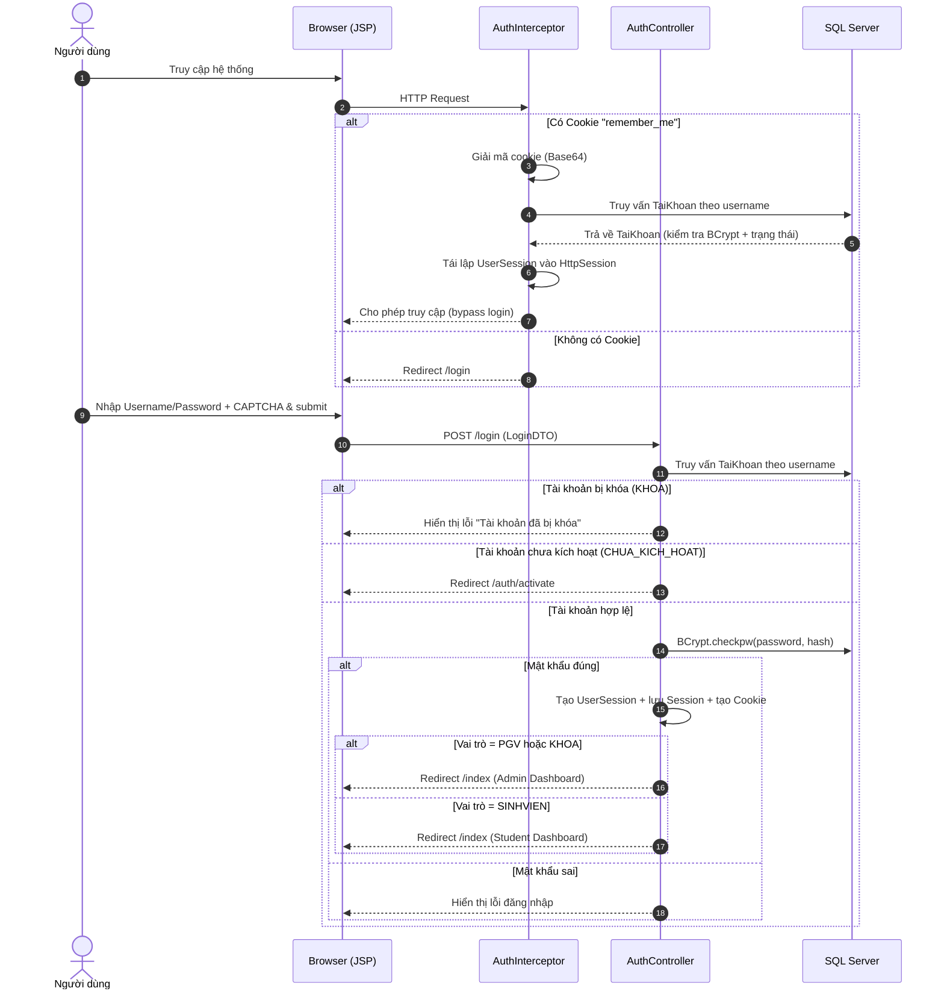
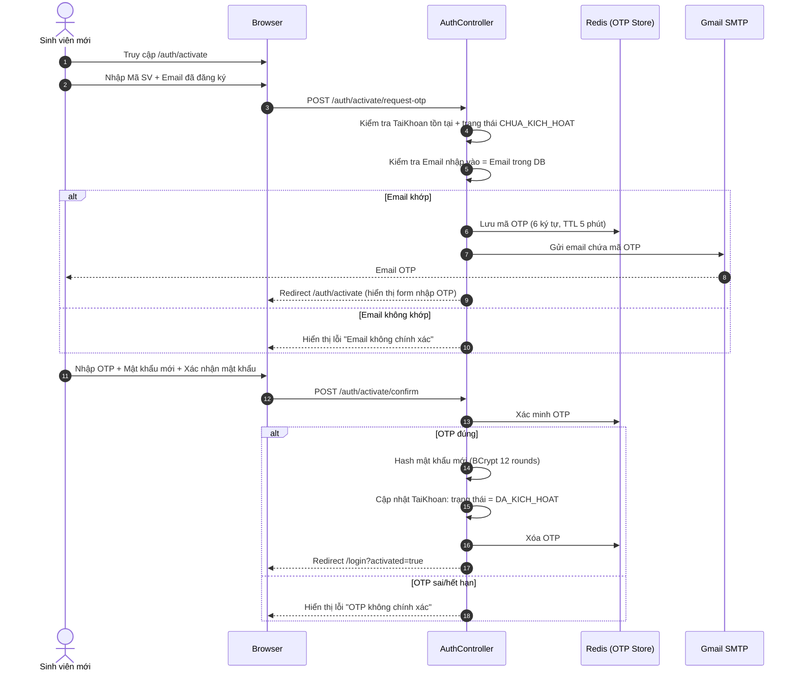
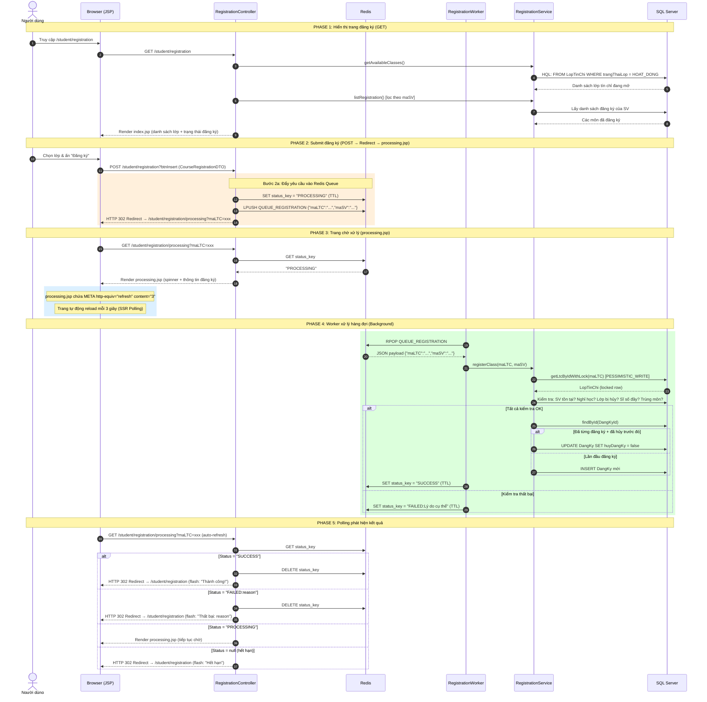
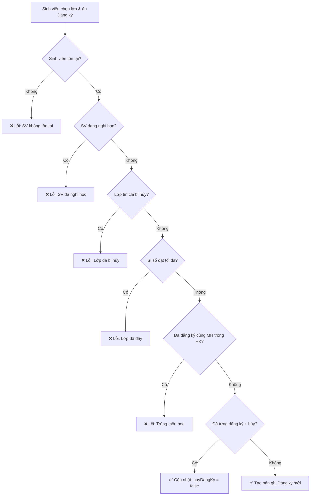
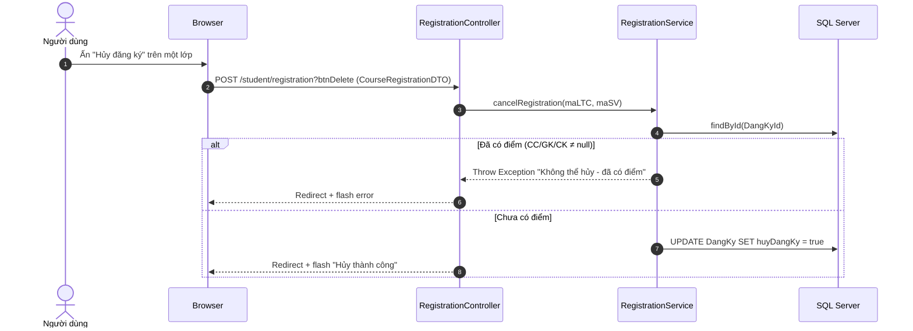
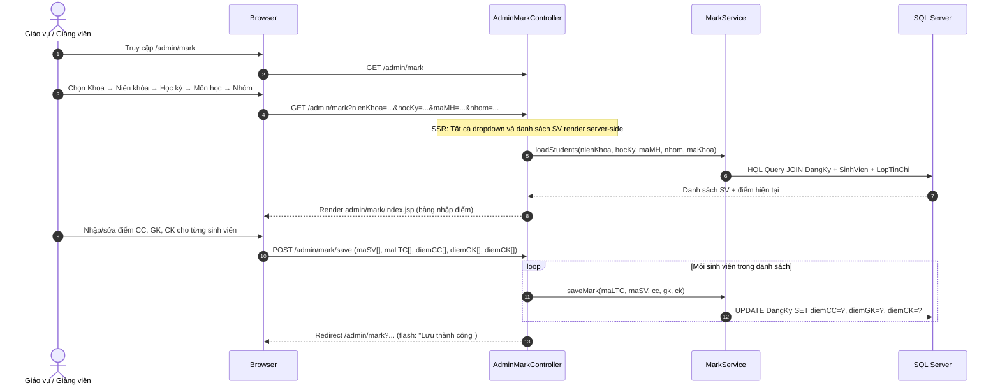
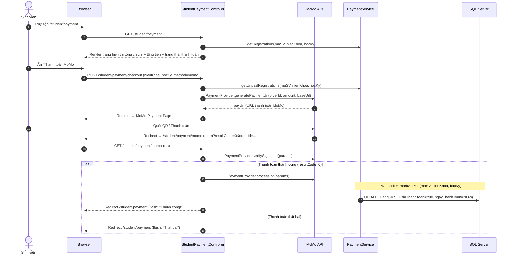
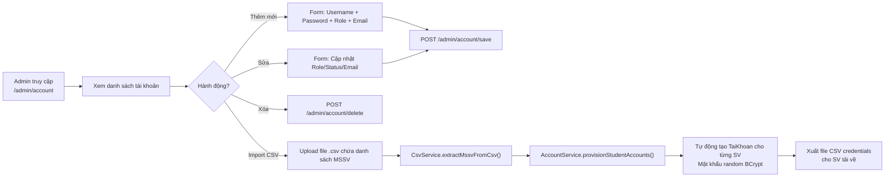
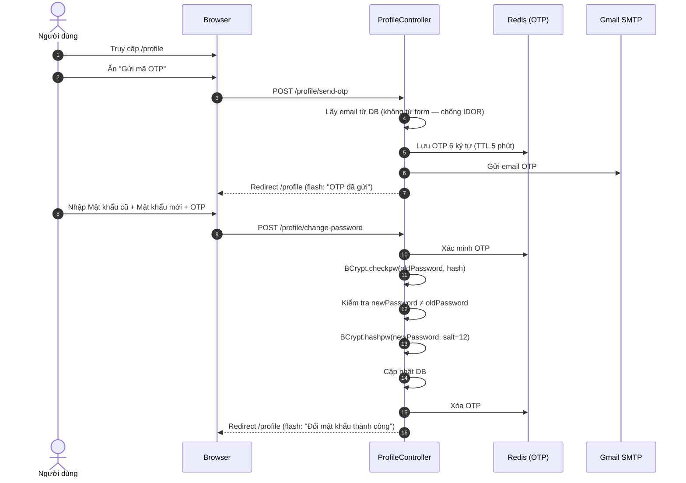

# 🏫 Dự Án Quản Lý Điểm Sinh Viên Hệ Tín Chỉ (QLDSV_HTC_WEB)

> - 🎓 **Học viện Công nghệ Bưu chính Viễn thông cơ sở tại TP. Hồ Chí Minh (PTITHCM)**
> - 📚 **Môn học:** Lập Trình Web
> - 👨‍🏫 **Giảng viên hướng dẫn:** Thầy Nguyễn Minh Hiếu

Chào mừng bạn đến với **QLDSV_HTC_WEB** - hệ thống Web quản lý điểm sinh viên học theo hệ thống tín chỉ.

Dự án được phát triển theo mô hình MVC sử dụng các công nghệ lõi mạnh mẽ bao gồm **Spring Framework** (Spring MVC, Spring ORM), **Hibernate**, và **SQL Server**. Hệ thống không chỉ đáp ứng xuất sắc các yêu cầu nghiệp vụ của môn học mà còn được mở rộng với các kỹ thuật Backend nâng cao (Redis, IPN Webhook, Docker).

[](#-ủng-hộ--donate)

> [!IMPORTANT]
> Toàn bộ luồng xử lý nghiệp vụ của hệ thống hoạt động theo mô hình **Server-Side Rendering (SSR)**. Mọi tương tác giữa người dùng và server đều thông qua **form submission** và **page redirect/reload** (PRG - Post/Redirect/Get pattern). Hệ thống **KHÔNG** sử dụng REST API hay AJAX cho các luồng nghiệp vụ chính, ngoại trừ module nhập điểm.

---

## 📘 Tài Liệu Liên Quan

> [!IMPORTANT]
> Dự án này đi kèm tài liệu tổng hợp kiến thức lý thuyết & thực hành liên quan đến lập trình web (Spring MVC, Hibernate ORM, JSTL, DI, Validation, Interceptor, i18n, etc.) cùng danh sách nhắc nhở các tính năng bắt buộc và nâng cao cần áp dụng.
>
> 👉 **[Đọc tài liệu tổng hợp kiến thức tại đây (LESSON NOTES)](./docs/lessons/Tong_hop_kien_thuc.md)**
>
> 👉 **[Đọc danh sách tính năng & lưu ý áp dụng tại đây](./docs/Luu_y_ap_dung.md)**

---

## 🏆 Nhật ký Bảo vệ Đồ án (05/06/2026)

Dự án đã được bảo vệ thành công với điểm số tuyệt đối 10/10. Dưới đây là tóm tắt quá trình vấn đáp thực tế và cách nhóm giải quyết các câu hỏi từ Giảng viên:

- **Mở đầu & Triển khai thực tế:** Ngay từ khi bắt đầu, nhóm đã cung cấp URL public cho thầy trải nghiệm trực tiếp. Nhóm nhấn mạnh dự án không chỉ chạy localhost mà đã được đóng gói hoàn chỉnh bằng Docker và deploy lên server thật.
- **Phân chia công việc:** Thầy hỏi về cách chia task. Nhóm (2 thành viên) chia sẻ rằng cả 2 cùng làm Full-stack và áp dụng quy trình giống môi trường doanh nghiệp: một người code xong thì người kia phải Cross-check/Code Review (Pull Request) thì tính năng mới được đưa vào dự án.
- **Demo Tính năng cốt lõi:** Nhóm tiến hành demo trôi chảy các luồng nghiệp vụ, đặc biệt trình bày chi tiết tính năng Xuất/Nhập dữ liệu hàng loạt bằng file CSV (Import/Export CSV).
- **Bắt lỗi và Validate Dữ liệu:** Nhóm cố tình demo nhập sai mật khẩu/bỏ trống trường dữ liệu. Thầy hỏi nhóm bắt lỗi bằng gì. Nhóm trả lời: Ở Client-side, dùng Bootstrap để hiển thị cảnh báo ngay trên UI. Ở tầng Backend, nhóm áp dụng 2 cách là Validation Annotations và Custom Validation.
- **Cấu hình Gửi Email:** Thầy yêu cầu giải thích tính năng Email. Nhóm show file spring-config-gmail.xml, giải thích cách truyền các Secret Key vào file properties (hoạt động tương tự file .env để ẩn key bảo mật), và cách dữ liệu được nạp vào Bean JavaMailSenderImpl.
- **Tính năng Nâng cao (Vượt ngoài giáo trình):** Thầy hỏi nhóm có làm thêm tính năng gì mới không. Nhóm tự tin demo và giải thích 2 luồng xử lý "nặng đô" nhất:
  - **Cổng thanh toán MoMo & Hóa đơn PDF:** Demo thực tế luồng quét mã QR và xử lý IPN để xác nhận thanh toán. Đặc biệt, nhóm trình bày luồng hệ thống tự động sinh hóa đơn điện tử định dạng PDF và gửi thẳng vào email của sinh viên ngay khi giao dịch thành công.
  - **Redis Cache:** Giải thích cơ chế lưu trữ dữ liệu tạm thời trên bộ nhớ RAM để tăng tốc độ truy xuất hệ thống.
- **ORM & Cơ sở dữ liệu:** Thầy hỏi hệ thống dùng công nghệ gì để tương tác với DB. Nhóm trả lời là Hibernate, sau đó mở trực tiếp source code (các file XML) và giải thích chi tiết luồng mapping dữ liệu cho thầy.

---

## 📚 Phân Chia Chương Bài Học (Mục lục chi tiết)

- **[Chương 1: Kiến Trúc Spring MVC & Luồng Xử Lý](./docs/lessons/Chuong_1_Spring_MVC.md)**
- **[Chương 2: Controller & Xử Lý Yêu Cầu](./docs/lessons/Chuong_2_Controller.md)**
- **[Chương 3: Làm Việc Với Form & Databinding](./docs/lessons/Chuong_3_Form.md)**
- **[Chương 4: Expression Language (EL) & JSTL](./docs/lessons/Chuong_4_EL_JSTL.md)**
- **[Chương 5: Dependency Injection, Upload File & Gửi Email](./docs/lessons/Chuong_5_Bean_DI_File_Email.md)**
- **[Chương 6: Tích Hợp Hibernate ORM & Transaction](./docs/lessons/Chuong_6_Hibernate.md)**
- **[Chương 7: Validation & Interceptor](./docs/lessons/Chuong_7_Validation_Interceptor.md)**
- **[Chương 8: Tổ Chức Giao Diện, Đa Ngôn Ngữ (i18n) & Trình Soạn Thảo](./docs/lessons/Chuong_8_To_Chuc_Giao_Dien.md)**

---

## 🛠️ Công Nghệ Sử Dụng

Dự án được xây dựng dựa trên ngăn xếp công nghệ (Tech Stack) chuẩn Enterprise:

- **Ngôn ngữ chính:** Java 17
- **Framework cốt lõi:** Spring Framework 6.1.4 (Web MVC, Transaction, ORM)
- **Công nghệ View:** Jakarta Servlet 6.0, JSP 3.1.1, JSTL 3.0
- **Thư viện ORM:** Hibernate 6.4.4.Final
- **Hệ quản trị CSDL:** SQL Server (sử dụng Driver `mssql-jdbc` phiên bản 12.4.2)
- **Bể chứa kết nối (Connection Pooling):** Apache Commons DBCP2
- **Hàng đợi & Cache:** Redis (Jedis client) — sử dụng cho Queue đăng ký tín chỉ, OTP xác thực email, Rate Limiting
- **Thanh toán trực tuyến:** MoMo Payment Gateway (Provider pattern)
- **Trình biên dịch & Đóng gói:** Maven
- **Web Server nhúng:** Apache Tomcat 10.x thông qua Cargo Maven Plugin

---

## 📂 Kiến Trúc Thư Mục Dự Án

Kiến trúc mã nguồn được phân chia rõ ràng theo mô hình layered, tổ chức theo **hai phân vùng URL** riêng biệt (`/admin/*` cho giáo vụ/khoa và `/student/*` cho sinh viên):

```text
QLDSV_HQT_WEB
├── Gendb.sql                                # File script tạo CSDL & dữ liệu mẫu SQL Server
├── pom.xml                                  # File quản lý thư viện và cấu hình Cargo plugin
├── db.dbml                                  # Bản vẽ thiết kế CSDL (Lowercase snake_case)
├── README.md                                # Tài liệu tổng quan dự án (File này)
├── docs/                                    # Thư mục lưu trữ tài liệu liên quan
│   ├── Luu_y_ap_dung.md                     # Danh sách lưu ý & các tính năng cần áp dụng
│   └── lessons/                             # Thư mục phân chia chương bài học
└── src
    └── main
        ├── java
        │   └── com
        │       └── ptithcm
        │           ├── entities/             # JPA Entity classes + @SQLRestriction Soft Delete
        │           │   ├── base/
        │           │   │   └── LuuVetThoiGian.java  # @MappedSuperclass (ngay_tao, ngay_cap_nhat, ngay_xoa)
        │           │   ├── DangKy.java              # Bảng đăng ký (composite PK: maLTC + maSV)
        │           │   ├── DangKyId.java            # Khóa chính phức hợp
        │           │   ├── GiangVien.java           # Bảng giảng viên
        │           │   ├── Khoa.java                # Bảng khoa
        │           │   ├── Lop.java                 # Bảng lớp sinh viên
        │           │   ├── LopTinChi.java           # Bảng lớp tín chỉ (UUID PK)
        │           │   ├── MonHoc.java               # Bảng môn học
        │           │   ├── SinhVien.java            # Bảng sinh viên
        │           │   ├── TaiKhoan.java            # Bảng tài khoản đăng nhập
        │           │   └── ThongBao.java            # Bảng thông báo
        │           ├── modules/
        │           │   ├── auth/                    # Xác thực (Login, Logout, Cookie, Kích hoạt TK)
        │           │   ├── home/                    # Trang chủ dashboard
        │           │   ├── announcement/            # Xem thông báo (tất cả vai trò)
        │           │   ├── profile/                 # Hồ sơ cá nhân, đổi mật khẩu, avatar
        │           │   ├── registration/            # Service & Worker xử lý đăng ký tín chỉ
        │           │   ├── mark/                    # Service quản lý điểm số
        │           │   ├── report/                  # Service báo cáo (Stored Procedure)
        │           │   ├── payment/                 # Service & Provider thanh toán MoMo
        │           │   ├── student/                 # ─── PHÂN VÙNG SINH VIÊN ───
        │           │   │   ├── StudentController.java    # CRUD SV (admin dùng)
        │           │   │   ├── registration/             # /student/registration
        │           │   │   ├── mark/                     # /student/mark
        │           │   │   └── payment/                  # /student/payment
        │           │   ├── admin/                   # ─── PHÂN VÙNG QUẢN TRỊ ───
        │           │   │   ├── account/             # /admin/account (CRUD tài khoản)
        │           │   │   ├── announcement/        # /admin/announcement (CRUD thông báo)
        │           │   │   ├── classroom/           # /admin/classroom (CRUD lớp)
        │           │   │   ├── creditclass/         # /admin/creditclass (CRUD lớp tín chỉ)
        │           │   │   ├── faculty/             # /admin/faculty (CRUD khoa)
        │           │   │   ├── lecturer/            # /admin/lecturer (CRUD giảng viên)
        │           │   │   ├── mark/                # /admin/mark (nhập điểm)
        │           │   │   ├── payment/             # /admin/payment (thống kê học phí)
        │           │   │   ├── registration/        # /admin/registration (đăng ký hộ SV)
        │           │   │   ├── report/              # /admin/report (xuất báo cáo)
        │           │   │   ├── student/             # /admin/student (quản lý SV)
        │           │   │   └── subject/             # /admin/subject (CRUD môn học)
        │           │   ├── account/                 # Service tài khoản
        │           │   ├── classroom/               # Service lớp
        │           │   ├── creditclass/             # Service lớp tín chỉ
        │           │   ├── faculty/                 # Service khoa
        │           │   ├── lecturer/                # Service giảng viên
        │           │   ├── subject/                 # Service môn học
        │           │   └── error/                   # Controller xử lý lỗi HTTP
        │           └── shared/
        │               ├── advices/                 # @ControllerAdvice (Global UI Config)
        │               ├── aspects/                 # Spring AOP (Audit Logging)
        │               ├── bases/                   # BaseDAO + HqlQueryBuilder
        │               ├── constants/               # Hằng số hệ thống (Message, Session, Cache)
        │               ├── dtos/                    # DTO dùng chung (Pagination, UserSession, Sort)
        │               ├── enums/                   # Enum (Role, TrangThaiDangKy, RegistrationStatus...)
        │               ├── events/                  # Spring Event
        │               ├── exceptions/              # Custom exceptions
        │               ├── interceptors/            # Auth, CSRF, RateLimit, AdminAuth
        │               ├── listeners/               # Event listeners
        │               ├── services/                # Redis, Mailer, Captcha, CSV, EmailOTP
        │               └── utils/                   # Date, Security, Session utilities
        ├── resources/
        │   └── i18n-res/                            # Tệp đa ngôn ngữ (global_vi.properties, global_en.properties)
        └── webapp/
            ├── resources/                           # CSS, JS tĩnh, uploads
            └── WEB-INF/
                 ├── config/                         # Spring Beans, MVC, Hibernate config
                 ├── views/                          # JSP views
                 │   ├── admin/                      # Giao diện quản trị (12 module)
                 │   ├── student/                    # Giao diện sinh viên (mark, payment, registration)
                 │   ├── announcement/               # Giao diện xem thông báo
                 │   ├── auth/                       # Login, Activate
                 │   ├── profile/                    # Hồ sơ cá nhân
                 │   ├── shared/                     # Header, Sidebar, Error pages (429, error)
                 │   └── index.jsp                   # Dashboard trang chủ
                 └── web.xml                         # DispatcherServlet & Filters config
```

---

## 👥 Vai Trò & Phân Quyền (RBAC)

Hệ thống cung cấp cơ chế phân quyền dựa trên 3 nhóm vai trò (Roles) chính. Mỗi vai trò có phân vùng URL riêng biệt:

| Quyền | Vai trò (Role Code)      | Phân vùng URL | Phạm vi thao tác                                                                                                           |
| :---- | :----------------------- | :------------ | :------------------------------------------------------------------------------------------------------------------------- |
| **1** | **PGV** (Phòng Giáo Vụ)  | `/admin/*`    | Toàn quyền CRUD trên tất cả danh mục. Nhập điểm, xuất báo cáo, quản lý tài khoản, thông báo, thống kê học phí toàn trường. |
| **2** | **KHOA** (Khoa)          | `/admin/*`    | Tương tự PGV nhưng **bị giới hạn phạm vi** theo mã Khoa đăng nhập. Chỉ xem/sửa dữ liệu thuộc Khoa mình.                    |
| **3** | **SINHVIEN** (Sinh Viên) | `/student/*`  | Đăng ký/Hủy đăng ký lớp tín chỉ, xem bảng điểm cá nhân, thanh toán học phí trực tuyến (MoMo).                              |

**Các trang dùng chung (tất cả vai trò):** `/profile`, `/announcements`, `/index` (Dashboard).

---

## 📋 Danh Sách Tính Năng Hệ Thống (Feature Checklist)

### 🛠️ 1. Các Tính Năng Nghiệp Vụ Cốt Lõi (Core Features)

- [x] **Quản lý danh mục (Category Management):**
  - [x] Quản lý thông tin Khoa (`/admin/faculty`).
  - [x] Quản lý thông tin Lớp học (`/admin/classroom`).
  - [x] Quản lý thông tin Sinh viên (`/admin/student`).
  - [x] Quản lý thông tin Giảng viên (`/admin/lecturer`).
  - [x] Quản lý danh mục Môn học (`/admin/subject`).
  - [x] Đảm bảo toàn vẹn dữ liệu (ràng buộc khóa chính, khóa ngoại, unique constraints).
- [x] **Quản lý Lớp tín chỉ (`/admin/creditclass`):**
  - [x] Mở lớp tín chỉ theo: Niên khóa, Học kỳ, Môn học, Nhóm.
  - [x] Cấu hình số lượng sinh viên tối thiểu (Min size) và tối đa (Max size).
  - [x] Cho phép hủy lớp tín chỉ nếu không đủ sinh viên tối thiểu.
- [x] **Đăng ký Lớp tín chỉ:**
  - [x] **Sinh viên** tự đăng ký tại `/student/registration`.
  - [x] **Giáo vụ/Khoa** đăng ký hộ sinh viên tại `/admin/registration`.
  - [x] Luồng xử lý bất đồng bộ qua Redis Queue + Worker (xem mục chi tiết bên dưới).
  - [x] Hỗ trợ Đăng ký & Hủy đăng ký trực tuyến.
  - [x] Kiểm tra trùng môn học trong cùng học kỳ, kiểm tra sĩ số tối đa.
- [x] **Quản lý Điểm số (`/admin/mark`):**
  - [x] Nhập điểm cho sinh viên theo lớp tín chỉ (3 cột: CC 10%, GK 30%, CK 60%).
  - [x] Lưu điểm đồng loạt qua form POST (SSR Batch Update).
  - [x] Sinh viên xem bảng điểm cá nhân tại `/student/mark`.
  - [x] Cấm hủy đăng ký lớp tín chỉ khi đã có điểm.
- [x] **Thanh toán học phí trực tuyến:**
  - [x] Sinh viên thanh toán qua MoMo tại `/student/payment`.
  - [x] Giáo vụ xem thống kê học phí theo lớp tại `/admin/payment`.
- [x] **In ấn Báo cáo (`/admin/report`):**
  - [x] Xuất danh sách sinh viên đăng ký lớp tín chỉ (SP: `sp_LayDanhSachSinhVienDangKyLopTinChi`).
  - [x] Xuất bảng điểm tổng kết lớp học (Dynamic Pivot SP: `sp_LayBangDiemTongKet`).
- [x] **Quản lý Tài khoản (`/admin/account`):**
  - [x] CRUD tài khoản đăng nhập cho sinh viên và giảng viên.
  - [x] Import hàng loạt tài khoản từ file CSV.
  - [x] Kích hoạt/Khóa tài khoản.
- [x] **Quản lý Thông báo (`/admin/announcement`):**
  - [x] CRUD thông báo toàn trường.
  - [x] Đánh dấu đã đọc/chưa đọc cho từng người dùng.
- [x] **Hồ sơ cá nhân (`/profile`):**
  - [x] Xem thông tin tài khoản.
  - [x] Đổi mật khẩu (yêu cầu xác thực OTP qua Email).
  - [x] Cập nhật ảnh đại diện (Upload file ảnh).

### ⚙️ 2. Các Cơ Chế & Kỹ Thuật Bắt Buộc (Mandatory Core Features)

- [x] **Đa ngôn ngữ (i18n):** Chuyển đổi giao diện linh hoạt giữa Tiếng Việt (`vi`) và Tiếng Anh (`en`) sử dụng `ReloadableResourceBundleMessageSource`, `CookieLocaleResolver` và `LocaleChangeInterceptor` của Spring.
- [x] **Chế độ Sáng/Tối (Light/Dark Mode):** Cho phép chuyển đổi giao diện sáng/tối và lưu trạng thái cục bộ vào LocalStorage để đồng bộ hiển thị mà không bị nhấp nháy trang.
- [x] **Gửi Email tự động (Email Service):** Cấu hình thư viện `javax.mail` và `JavaMailSenderImpl` sử dụng Gmail SMTP thật để gửi email OTP kích hoạt tài khoản và xác thực đổi mật khẩu.
- [x] **Xác thực CAPTCHA cục bộ (Local Image CAPTCHA):** Sinh ảnh CAPTCHA ngẫu nhiên hoàn toàn trên server bằng `BufferedImage` và lưu đáp án vào `HttpSession` để xác thực form đăng nhập.

### 🚀 3. Các Cơ Chế Nâng Cao & Tối Ưu Hệ Thống (Advanced Features)

- [x] **Mô hình kiến trúc 3-Tier chuẩn:** Tổ chức mã nguồn chặt chẽ theo lớp: Entity ➡️ DAO ➡️ Service ➡️ Controller.
- [x] **Chống lỗ hổng Mass Assignment:** Loại bỏ việc nhận trực tiếp Entity từ form submit, thay thế bằng DTO (Data Transfer Objects) có chú thích Jakarta Bean Validation.
- [x] **Bảo mật mã hóa mật khẩu:** Sử dụng thuật toán băm **BCrypt** (độ an toàn 12 rounds) để mã hóa mật khẩu.
- [x] **Bảo mật chống tấn công CSRF:** Triển khai `CsrfInterceptor` sinh CSRF token lưu trong session và chèn hidden input `csrf_token` vào tất cả form POST. Token bị thiếu/sai ➡️ redirect `/login?error=session_expired`.
- [x] **Xử lý Race Condition (Pessimistic Locking):** Sử dụng `LockMode.PESSIMISTIC_WRITE` khi đọc `LopTinChi` trong luồng đăng ký để ngăn đăng ký vượt sĩ số tối đa.
- [x] **Chống Spam & Rate Limiting (Bucket4j):** `RateLimitInterceptor` chặn tối đa 5 requests/giây cho `POST/PUT/DELETE` trên mỗi Session/IP ➡️ chuyển hướng `429.jsp`.
- [x] **Optimistic Locking:** Cột `@Version` trên `SinhVien`, `GiangVien`, `TaiKhoan`, `ThongBao` để phát hiện xung đột ghi đè.
- [x] **Hàng đợi đăng ký tín chỉ bất đồng bộ (Redis Queue):** Payload đăng ký ➡️ Redis List ➡️ `RegistrationWorker` tiêu thụ tuần tự ➡️ `processing.jsp` polling kết quả (chi tiết ở mục luồng đăng ký).
- [x] **Bắt lỗi tập trung (@ControllerAdvice):** `GlobalUIConfigAdvice` xử lý toàn bộ exception và cấu hình UI chung.
- [x] **Ghi vết hệ thống (AOP Audit Logging):** `AuditLogAspect` sử dụng Spring AOP ghi nhật ký các hành động thay đổi dữ liệu nhạy cảm.
- [x] **UUID Khóa chính:** Sử dụng UUID cho `LopTinChi` thay vì ID tự tăng.
- [x] **Lưu vết thời gian (Audit Trails):** `LuuVetThoiGian` với `@PrePersist`, `@PreUpdate` tự động điền `createdAt`, `updatedAt`.
- [x] **Global Soft Delete Filtering:** Áp dụng `@SQLRestriction("ngay_xoa IS NULL")` trên tất cả Entity có cột `ngay_xoa`. Hibernate tự động loại trừ bản ghi đã xóa mềm khỏi mọi truy vấn.
- [x] **Dynamic Pivot Procedure:** Stored procedure xoay ngang dữ liệu môn học linh hoạt trên SQL Server.
- [x] **Clean View Layer:** 100% EL và JSTL, không sử dụng Java Scriptlet trong JSP.
- [x] **Kích hoạt tài khoản lần đầu (Email OTP):** Sinh viên mới phải kích hoạt tài khoản bằng mã OTP gửi qua email + đặt mật khẩu mới.
- [x] **Thanh toán trực tuyến MoMo:** Tích hợp cổng thanh toán MoMo qua Provider Pattern với hỗ trợ IPN callback.

---

## 🔄 Quy Trình & Luồng Xử Lý Tính Năng (Feature Flows)

### 1. Luồng Đăng Nhập & Tái Lập Phiên Làm Việc (Authentication Flow)



**Chi tiết kỹ thuật:**

- `AuthInterceptor` chạy trước mọi request, tự động khôi phục session từ cookie `remember_me` (Base64 encoded, 30 ngày).
- Kiểm tra `TrangThaiTaiKhoan` (`DA_KICH_HOAT`, `CHUA_KICH_HOAT`, `KHOA`) trước khi cho phép truy cập.
- `AdminAuthInterceptor` kiểm tra thêm phân quyền URL `/admin/*` chỉ cho PGV và KHOA.
- `CsrfInterceptor` kiểm tra CSRF token cho mọi request POST/PUT/DELETE.

---

### 2. Luồng Kích Hoạt Tài Khoản Lần Đầu (First-Time Account Activation)



---

### 3. ⭐ Luồng Đăng Ký Lớp Tín Chỉ (Course Registration Flow — Chi tiết)

> [!IMPORTANT]
> Đây là luồng phức tạp nhất của hệ thống, sử dụng **Redis Queue** cho xử lý bất đồng bộ và **`processing.jsp`** cho Server-Side Polling. Hoạt động giống hệt nhau cho cả **Sinh viên** (`/student/registration`) và **Giáo vụ** (`/admin/registration`).



**Giải thích chi tiết `processing.jsp`:**

| Yếu tố                      | Chi tiết                                                                                                                                                                                                 |
| :-------------------------- | :------------------------------------------------------------------------------------------------------------------------------------------------------------------------------------------------------- |
| **Khi nào hiển thị?**       | Ngay sau khi Controller đẩy payload vào Redis Queue và redirect user.                                                                                                                                    |
| **Hiển thị bằng cách nào?** | Controller trả về view name `"student/registration/processing"` → JSP render trang chờ với spinner animation.                                                                                            |
| **Cơ chế polling?**         | JSP chứa thẻ `<meta http-equiv="refresh" content="3;url=...">` → trình duyệt tự động reload trang mỗi **3 giây** (hoàn toàn SSR, KHÔNG dùng AJAX).                                                       |
| **Mỗi lần reload?**         | Browser gửi GET request mới → Controller kiểm tra `status_key` trong Redis → nếu vẫn `PROCESSING` thì render lại `processing.jsp`; nếu `SUCCESS`/`FAILED` thì redirect về trang chính kèm flash message. |
| **Khi nào biến mất?**       | Khi Worker xử lý xong (status ≠ `PROCESSING`), Controller redirect về `/student/registration` → trang `processing.jsp` không còn được render nữa.                                                        |

**Ràng buộc nghiệp vụ khi đăng ký:**



---

### 4. Luồng Hủy Đăng Ký Lớp Tín Chỉ (Cancel Registration Flow)



> [!WARNING]
> Hủy đăng ký **KHÔNG** sử dụng Redis Queue — thực hiện **đồng bộ ngay lập tức** vì không có rủi ro race condition (chỉ cập nhật trạng thái, không kiểm tra sĩ số).

---

### 5. Luồng Nhập Điểm Số (Marks Management Flow)



**Sinh viên xem điểm:** Truy cập `/student/mark` → `StudentMarkController` gọi `markService.getStudentGrades(maSV)` → kết quả được nhóm theo học kỳ (`LinkedHashMap`) → render `student/mark/index.jsp`.

---

### 6. Luồng Thanh Toán Học Phí MoMo (Payment Flow)



---

### 7. Luồng Xuất Báo Cáo (Reports Flow)

Hệ thống cung cấp hai loại báo cáo chính tại `/admin/report` gọi thông qua stored procedure:

| Loại báo cáo                 | Stored Procedure                        | Mô tả                                                                                                    |
| :--------------------------- | :-------------------------------------- | :------------------------------------------------------------------------------------------------------- |
| **Danh sách SV đăng ký LTC** | `sp_LayDanhSachSinhVienDangKyLopTinChi` | Lọc theo niên khóa, học kỳ, môn học, nhóm. Tự động loại trừ bản ghi soft-deleted.                        |
| **Bảng điểm tổng kết lớp**   | `sp_LayBangDiemTongKet`                 | Xoay ngang cột môn học (Dynamic Pivot). Cột được sinh động dựa trên danh sách môn học mà lớp đã đăng ký. |

**Luồng SSR:** User chọn bộ lọc → form GET → Controller gọi `ReportService` → Service gọi `ReportDAO` → DAO gọi Stored Procedure → Kết quả trả về dạng `List<Map<String, Object>>` → JSP render bảng dữ liệu.

---

### 8. Luồng Quản Lý Tài Khoản & Import CSV (Account Management)



---

### 9. Luồng Đổi Mật Khẩu (Password Change Flow)



---

## 🛡️ Chuỗi Interceptor (Request Pipeline)

Mọi HTTP request đều đi qua chuỗi interceptor theo thứ tự sau trước khi đến Controller:

```text
HTTP Request
    │
    ▼
┌─────────────────────────┐
│  1. AuthInterceptor      │  Khôi phục session từ cookie, kiểm tra đăng nhập,
│                         │  kiểm tra trạng thái tài khoản (KHOA/CHUA_KICH_HOAT)
└────────────┬────────────┘
             │
             ▼
┌─────────────────────────┐
│  2. AdminAuthInterceptor │  Chỉ áp dụng cho /admin/*
│                         │  Kiểm tra role = PGV hoặc KHOA
└────────────┬────────────┘
             │
             ▼
┌─────────────────────────┐
│  3. CsrfInterceptor     │  GET → sinh token; POST/PUT/DELETE → kiểm tra token
│                         │  Token sai → redirect /login?error=session_expired
│                         │  Đồng thời inject pusherKey + pusherCluster vào request
└────────────┬────────────┘
             │
             ▼
┌─────────────────────────┐
│  4. RateLimitInterceptor │  Chặn spam POST/PUT/DELETE > 5 req/s per session
│                         │  Vi phạm → redirect 429.jsp
└────────────┬────────────┘
             │
             ▼
┌─────────────────────────┐
│  5. Controller           │  Xử lý nghiệp vụ
└─────────────────────────┘
```

---

## 🗃️ Mô Hình Soft Delete

Tất cả Entity kế thừa `LuuVetThoiGian` đều hỗ trợ xóa mềm:

| Hành vi                    | Cơ chế                                                                                                                             |
| :------------------------- | :--------------------------------------------------------------------------------------------------------------------------------- |
| **Xóa**                    | `UPDATE SET ngay_xoa = NOW()` (không DELETE vật lý)                                                                                |
| **Truy vấn**               | `@SQLRestriction("ngay_xoa IS NULL")` tự động lọc bản ghi đã xóa                                                                   |
| **Stored Procedures**      | Đã được ALTER để thêm `AND ngay_xoa IS NULL`                                                                                       |
| **Tái tạo bản ghi đã xóa** | Native SQL hard-delete bản ghi cũ trước khi INSERT mới. Nếu có FK reference (dữ liệu lịch sử) → từ chối tái tạo với thông báo lỗi. |

---

## 🚀 Hướng Dẫn Cài Đặt & Chạy Dự Án

👉 **[Xem Hướng dẫn Cài đặt & Chạy Project chi tiết tại đây](docs/SETUP.md)**

---

## 📊 Bản Đồ URL Hệ Thống (URL Map)

### Trang công khai (Không cần đăng nhập)

| URL              | Method   | Controller       | Mô tả                       |
| :--------------- | :------- | :--------------- | :-------------------------- |
| `/login`         | GET      | `AuthController` | Hiển thị form đăng nhập     |
| `/login`         | POST     | `AuthController` | Xử lý đăng nhập             |
| `/logout`        | GET      | `AuthController` | Đăng xuất + xóa cookie      |
| `/auth/activate` | GET/POST | `AuthController` | Kích hoạt tài khoản lần đầu |

### Trang dùng chung (Tất cả vai trò sau đăng nhập)

| URL                          | Method | Controller               | Mô tả                |
| :--------------------------- | :----- | :----------------------- | :------------------- |
| `/`, `/index`, `/home`       | GET    | `HomeController`         | Dashboard trang chủ  |
| `/profile`                   | GET    | `ProfileController`      | Xem hồ sơ cá nhân    |
| `/profile/send-otp`          | POST   | `ProfileController`      | Gửi OTP đổi mật khẩu |
| `/profile/change-password`   | POST   | `ProfileController`      | Đổi mật khẩu         |
| `/profile/update-avatar`     | POST   | `ProfileController`      | Upload ảnh đại diện  |
| `/announcements`             | GET    | `AnnouncementController` | Danh sách thông báo  |
| `/announcements/detail/{id}` | GET    | `AnnouncementController` | Chi tiết thông báo   |

### Phân vùng Sinh viên (`/student/*`)

| URL                                | Method             | Controller                      | Mô tả                     |
| :--------------------------------- | :----------------- | :------------------------------ | :------------------------ |
| `/student/registration`            | GET                | `StudentRegistrationController` | Trang đăng ký lớp tín chỉ |
| `/student/registration`            | POST (`btnInsert`) | `StudentRegistrationController` | Đăng ký lớp → Redis Queue |
| `/student/registration`            | POST (`btnDelete`) | `StudentRegistrationController` | Hủy đăng ký lớp           |
| `/student/registration/processing` | GET                | `StudentRegistrationController` | Trang chờ xử lý (polling) |
| `/student/mark`                    | GET                | `StudentMarkController`         | Xem bảng điểm cá nhân     |
| `/student/payment`                 | GET                | `StudentPaymentController`      | Xem/thanh toán học phí    |
| `/student/payment/checkout`        | POST               | `StudentPaymentController`      | Tạo link thanh toán MoMo  |
| `/student/payment/momo-return`     | GET                | `StudentPaymentController`      | Callback trả về từ MoMo   |

### Phân vùng Quản trị (`/admin/*`)

| URL                              | Method   | Controller                    | Mô tả                          |
| :------------------------------- | :------- | :---------------------------- | :----------------------------- |
| `/admin/faculty`                 | GET/POST | `AdminFacultyController`      | CRUD Khoa                      |
| `/admin/classroom`               | GET/POST | `AdminClassroomController`    | CRUD Lớp                       |
| `/admin/student`                 | GET/POST | `AdminStudentController`      | CRUD Sinh viên                 |
| `/admin/lecturer`                | GET/POST | `AdminLecturerController`     | CRUD Giảng viên                |
| `/admin/subject`                 | GET/POST | `AdminSubjectController`      | CRUD Môn học                   |
| `/admin/creditclass`             | GET/POST | `AdminCreditClassController`  | CRUD Lớp tín chỉ               |
| `/admin/registration`            | GET/POST | `AdminRegistrationController` | Đăng ký hộ SV (Redis Queue)    |
| `/admin/registration/processing` | GET      | `AdminRegistrationController` | Trang chờ xử lý                |
| `/admin/mark`                    | GET      | `AdminMarkController`         | Xem danh sách SV cần nhập điểm |
| `/admin/mark/save`               | POST     | `AdminMarkController`         | Lưu điểm hàng loạt             |
| `/admin/report`                  | GET      | `AdminReportController`       | Xuất báo cáo (2 loại SP)       |
| `/admin/account`                 | GET/POST | `AdminAccountController`      | CRUD Tài khoản                 |
| `/admin/account/import`          | POST     | `AdminAccountController`      | Import CSV tạo hàng loạt TK    |
| `/admin/announcement`            | GET      | `AdminAnnouncementController` | Danh sách thông báo            |
| `/admin/announcement/create`     | GET      | `AdminAnnouncementController` | Form tạo thông báo             |
| `/admin/announcement/edit`       | GET      | `AdminAnnouncementController` | Form sửa thông báo             |
| `/admin/announcement/save`       | POST     | `AdminAnnouncementController` | Lưu thông báo (add/edit)       |
| `/admin/announcement/delete`     | POST     | `AdminAnnouncementController` | Xóa thông báo                  |
| `/admin/payment`                 | GET      | `AdminPaymentController`      | Thống kê học phí theo lớp      |

---

## 🧼 Định Dạng Mã Nguồn (Code Formatting)

Dự án tích hợp công cụ **Spotless** (`spotless-maven-plugin`) để tự động định dạng mã nguồn theo tiêu chuẩn (Java Google Format style AOSP).

Bạn có thể chạy các lệnh kiểm tra và tự động căn chỉnh mã nguồn qua **Makefile**:

- **Tự động định dạng toàn bộ mã nguồn (Java, XML, Markdown):**
  ```bash
  make format
  ```
- **Kiểm tra xem mã nguồn đã đúng chuẩn định dạng chưa (không sửa file):**
  ```bash
  make lint
  ```

---

## 👨‍💻 Đội ngũ phát triển (Contributors)

Dự án được thiết kế, phát triển và tối ưu bởi nhóm 2 thành viên. Chúng mình đã áp dụng quy trình làm việc thực chiến (Code Review, Pull Request) để mang lại một kiến trúc hệ thống ổn định nhất.

| <div align="center"><br /><sub><b>Phan Tuấn Quốc Anh (Peter Phan)</b></sub></div> | <div align="center"><br /><sub><b>Lương Chí Vinh (Ryan Luong)</b></sub></div> |
| :------------------------------------------------------------------------------------------------------------------------------------------------: | :--------------------------------------------------------------------------------------------------------------------------------------------------: |
|                                                  [🔗 GitHub Profile](https://github.com/ptquanh)                                                   |                                                [🔗 GitHub Profile](https://github.com/chivinh123abc)                                                 |

> _Nếu bạn thấy dự án này thú vị hoặc có bất kỳ câu hỏi nào về kiến trúc code, đừng ngần ngại kết nối với chúng mình qua GitHub nhé!_

---

## ☕ Ủng hộ / Donate

Nếu mã nguồn này giúp ích cho bạn trong quá trình học tập Spring Boot hoặc làm đồ án, hãy cân nhắc mời nhóm một ly cà phê nhé! Sự ủng hộ của bạn là động lực rất lớn.

- **Ngân hàng:** MB Bank
- **Chủ tài khoản:** PHAN TUAN QUOC ANH
- **Số tài khoản:** 042055678888
